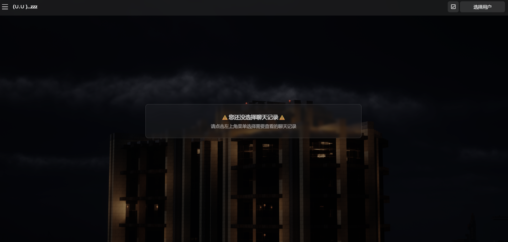
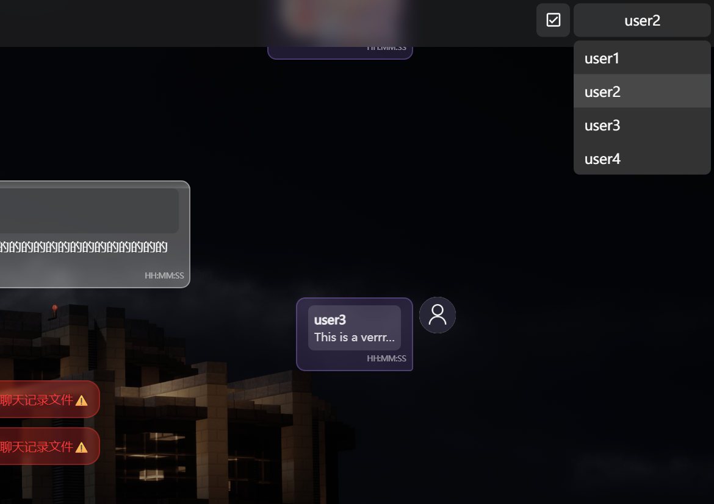
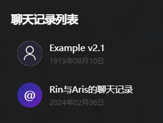
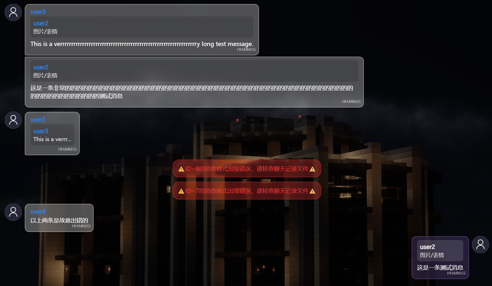
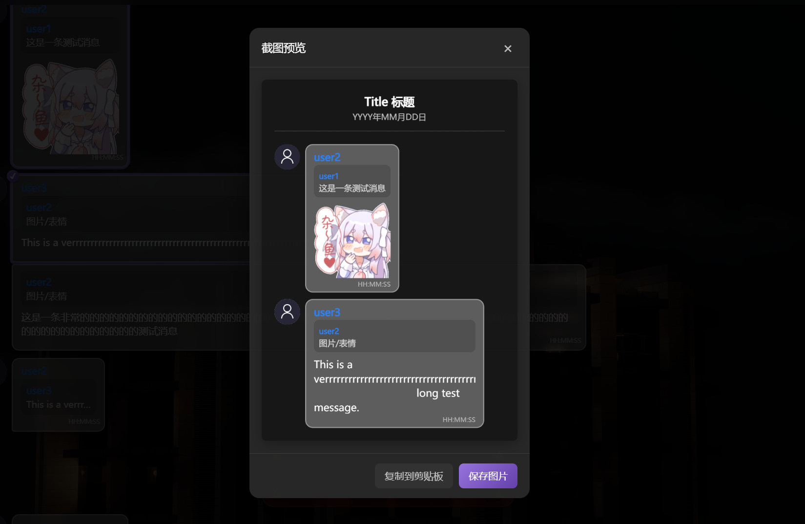
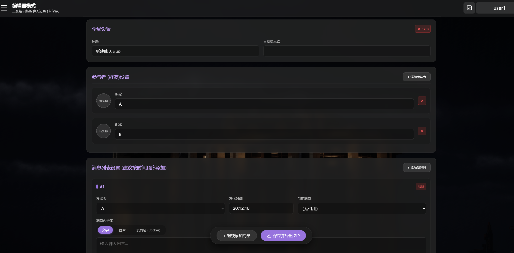

> [!IMPORTANT]
> 
> 本项目和这个README都还在完善之中    
>如有新功能建议请在[Issue](https://github.com/MCAbleBlank/rinhub_chat_history/issues)提交

# 脱离平台展示聊天记录的网页
在网页上展示任意聊天记录，目前需要手动输入  

<div align="center">

[聊天记录文件格式](#格式) | [目前的功能](#功能)

</div>

## 效果预览    


## 功能
- 记录多个成员的消息，在右上角切换    

- 多个聊天记录    

- 支持展示图片，文字，引用，表情
- 加载消息和聊天记录失败时提示    

- 新增导出为图片功能

- 新增编辑器与导出为.zip

## Coming Sooooon
- [ ] 加入“旁观”功能
- [ ] 尝试支持从其他形式直接生成

## 格式
### 导出的压缩包结构
```text
.
├── history.json          # 记录主要内容的主文件 (JSON 格式)
├── avatar/               # 存放参与者头像的文件夹
│   └── [participant_id].png/jpg
├── image/                # 存放聊天中发送的图片的文件夹
│   └── [message_id].png/jpg
└── sticker/              # 存放聊天中发送的表情包 (Sticker) 的文件夹
    └── [message_id].png/jpg
```


### 其中的history.json结构
```json
{
    "version": "2.1",
    "title": "这是聊天记录的标题",
    "date": "YYYY年MM月DD日 这是聊天记录的日期",
    "participants": {
        "participant_id": {
            "nick_name": "显示的发送者的昵称",
            "avatar": "头像图片的位置 ./path/to/avatar.png"
        },
        "user1": {
            "nick_name": "user1",
            "avatar": "./path/to/avatar1.png"
        },
        "user2": {
            "nick_name": "user2",
            "avatar": "./path/to/avatar2.png"
        }
    },
    "messages": [
        {
            "id": "example",
            "sender": "与上方设定的该发送者的participant_id一至",
            "content": {
                "image": "./path/to/image.png 如果type为image或者sticker，则填入图片文件位置",
                "text": "Example text. 如果type为text，则填入文字",
                "sticker": "./path/to/sticker.png 如果type为sticker，则填入表情包文件位置",
                "quote": "0 引用的消息的id",
                "↑↑": "以上的种类允许为image | text | sticker | quote 这四种 注意，每条消息只能有一条引用，并且ID必须是在这条消息之前的消息，引用信息永远会被渲染在消息气泡内的最上方 sticker在每条消息只能存在一个，并且这条消息只能有sticker除quote以外的这一个内容 image和text的顺序决定了它们的显示顺序 "
            },
            "time": "HH:MM:SS"
        },
        {
            "id": "1",
            "sender": "user1",
            "content": {
                "image": "./path/to/image.png 如果type为image或者sticker，则填入图片文件位置",
                "text": "这是一条测试消息"
            },
            "time": "11:45:14"
        },
        {
            "id": "2",
            "sender": "user2",
            "content": {
                "quote": "1",
                "sticker": "./path/to/sticker.png 如果type为sticker，则填入表情包文件位置"
            },
            "time": "11:45:15"
        }
    ]
}
```