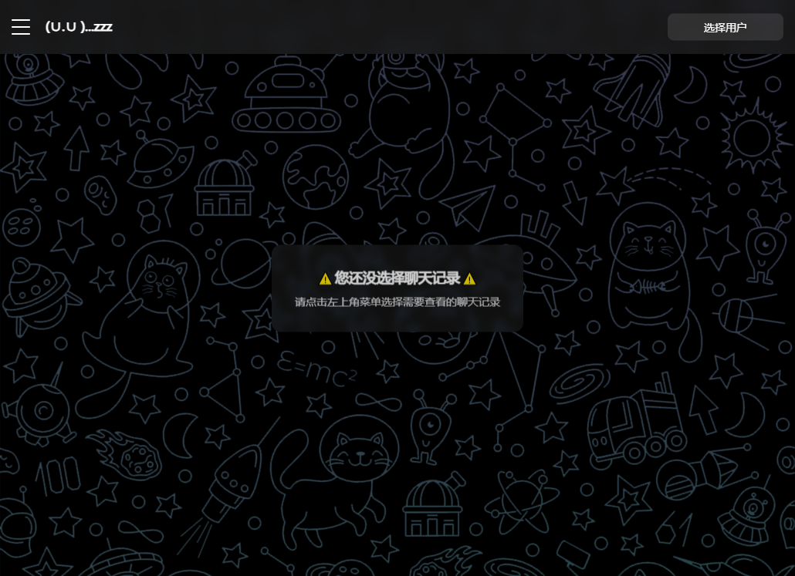
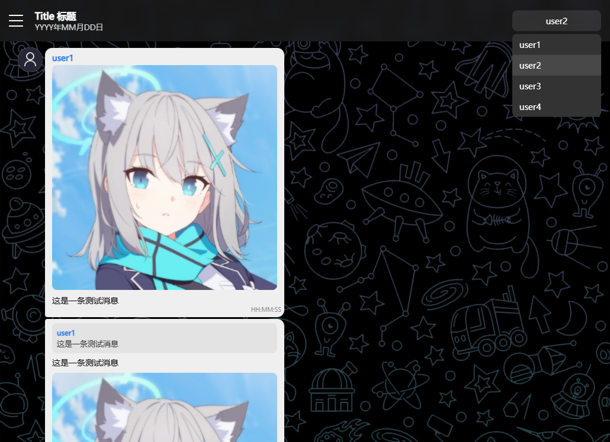
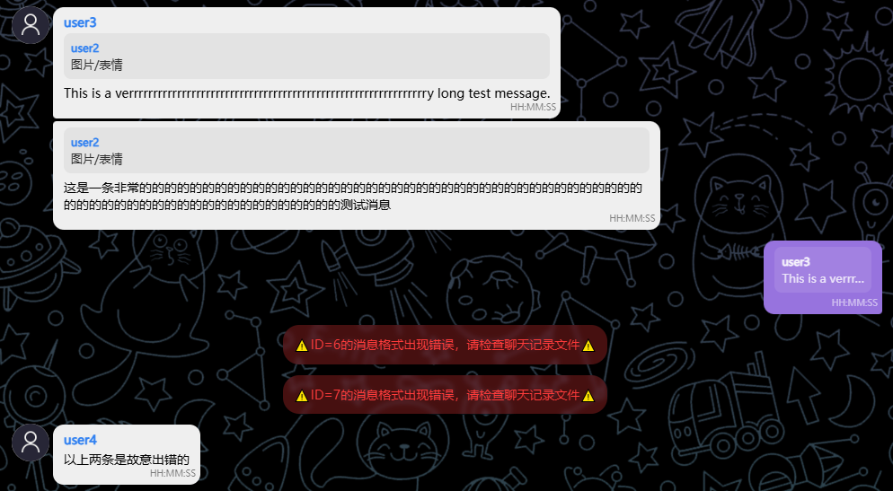

> [!IMPORTANT]
> 
> 本项目和这个README都还在完善之中    
>如有新功能建议请在[Issue](https://github.com/MCAbleBlank/rinhub_chat_history/issues)提交

# [Rinlithub](https://hub.rinlit.cn/)聊天记录网页
一个为Rinhub开发的用以展示群友聊天记录的网页，    

<div align="center">

[聊天记录文件(.json)格式](#聊天记录文件格式) | [目前的功能](#功能) | [贡献者](#特别鸣谢)

</div>

## 效果预览    


## 功能
- 记录多个成员的消息，在右上角切换    

- 多个聊天记录    

- 支持展示图片，文字，引用，表情包
- 加载消息和聊天记录失败时提示    


## Coming Sooooon
- [ ] 加入“旁观”功能
- [ ] 编写把旧版QQ复制来的聊天记录直接转换为json的工具
- [ ] 优化代码

## 聊天记录文件格式

```json
{
    "version": "2.1",
    "title": "这是聊天记录的标题",
    "date": "YYYY年MM月DD日 这是聊天记录的日期",
    "participants": {
        "example": {
            "nick_name": "另一位发送者的昵称，尽量简短",
            "avatar": "头像图片的位置 ./path/to/avatar.png" 
        }
    },
    "messages": [
        {
            "id": "example",
            "sender": "发送者的昵称，与上方设定的nick_name",
            "content": {
                "image": "./path/to/image.png 如果type为image或者sticker，则填入图片文件位置",
                "text": "Example text. 如果type为text，则填入文字",
                "sticker": "./path/to/sticker.png 如果type为sticker，则填入表情包文件位置",
                "quote": "0 引用的消息的id",
                "↑↑": "以上的种类允许为image | text | sticker | quote 这四种 注意，每条消息只能有一条引用，并且ID必须是在这条消息之前的消息，引用信息永远会被渲染在消息气泡内的最上方 sticker在每条消息只能存在一个，并且这条消息只能有sticker除quote以外的这一个内容 image和text的顺序决定了它们的显示顺序 "
            },
            "time": "HH:MM:SS"
        }
    ]
}
```

## 特别鸣谢

### Rinlit
- 提供了截图中的第二个聊天记录（当然还有更多）
- 

### Telegram
- 让我有了合并消息气泡和其他网页设计上的想法
- 提供了[背景图](./image/bg/telegram.png)
- 让我每天了解时政和生理知识🦌

### 群友
- 设了很多精，提供素材
- 对我要加多p😋功能表示极大地支持
